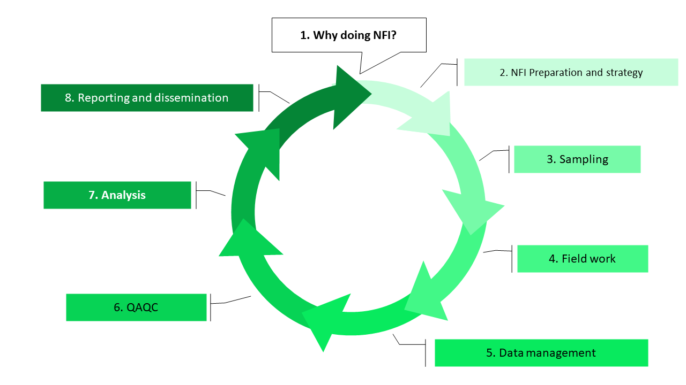

```{r setup, include=FALSE}
## Libraries
library(learnr)
library(tidyverse)
library(ggdark)

## Options for checking
# tutorial_options(
#   exercise.timelimit = 40, 
#   exercise.checker = gradethis::grade_learnr,
#   exercise.error.check.code = gradethis::grade_learnr_error
#   )

## Hide non-exercise R chunks
knitr::opts_chunk$set(echo = FALSE)
```


```{r gr-design, include=FALSE}
library(ggdark)
set_plot_style   <- "dark" ## Choose between  dark, light and print
source("R/graphic-design.R")

```

## Introduction

Welcome to the section 7 of the training modules on National Forest Inventory. Here we are going to talk about data analysis. And we are going to practice some of the key calculation steps together with the statistical language R.

Please watch the introduction video below and let's get started!

<center>

{width='80%'}

</center>

## Overview of data analysis

The data analysis builds on all the previous topics covered in the NFI modules and it's very important to have a good understanding of each of these steps before even starting to think about the data analysis. 

```{r module-wheel, fig.align='center', fig.cap="NFI modules wheel."}



```

### Analogy with photography

Let's have a look at two photos taken with the same target, a plant on a table. Let's not debate on the artistic value of these two pictures but analyze which one is easiest to edit and publish. 

INSERT bad photo / good photo

```{r choose-pic}
question("Which picture will be easier to edit for publication?",
    answer("left picture"),
    answer("right picture", correct = TRUE),
    allow_retry = TRUE
  )
```


### Analogy with photography (cont.)

The right photography indeed. If we look at the photography on the left, the objective is not clear, the whole terrace is on the photo, the light is not right, the photo is also rotated. To transform this photo into a publication ready image, the editor will have to rotate the image, crop it and correct the light. With the right photo however, a small tuning of the light would be enough.

Well, data analysis works the same way. If the objectives of the NFI are not clear, the sampling design is not tailored to the key variables of interest, or the field work not well prepared, the following data analysis is going to be very tedious and complex statistics required to correct for all the potential sources of error, if that is even possible.

On the opposite side, with a good design and implementation, based on clear objectives, the data analysis step can be rather straightforward and relatively simple.


## What tools and applications for NFI data analysis?

TBD


## Hands on R

Here we are going to use R to visualize the trees of one plot.  **This is a demo of embedded shiny apps**

### Create tree data based on plot basal area

```{r create-tree, include=FALSE}
source("R/create-trees.R")
```

```{r, echo=FALSE}
sliderInput("basal_area", HTML(paste0("Basal area (m", tags$sup("2"), "/ha): ")), min = 10, max = 80, value = 40, step = 5)
radioButtons("show_model", "Display the HxD model?", c("Default", "Show model"))
plotOutput("gr_ba")
```

```{r, context="server"}

output$gr_ba <- renderPlot({
  
  make_trees(.input_ba = input$basal_area, .input_model = input$show_model, )
  
})
```

### See the tree table

```{r make-data, include=FALSE}
tree <- make_trees(.input_ba = 60, .input_model = FALSE, .table = TRUE)
```

Let's continue with the plot that has basal area of around 60 m^2^/ha. The table is stored in a R object called `tree`. We can look at the table by running it's name in  the console.

```{r show-data, exercise=TRUE, exercise.lines=3}
tree
```


## Default template stuff

### Exercise with Hint

*Here's an exercise where the chunk is pre-evaulated via the `exercise.eval` option (so the user can see the default output we'd like them to customize). We also add a "hint" to the correct solution via the chunk immediate below labeled `print-limit-hint`.*

Modify the following code to limit the number of rows printed to 5:

```{r print-limit, exercise=TRUE, exercise.eval=TRUE}
mtcars
```

```{r print-limit-hint}
head(mtcars)
```

### Quiz

*You can include any number of single or multiple choice questions as a quiz. Use the `question` function to define a question and the `quiz` function for grouping multiple questions together.*

Some questions to verify that you understand the purposes of various base and recommended R packages:

```{r quiz}
quiz(
  question("Which package contains functions for installing other R packages?",
    answer("base"),
    answer("tools"),
    answer("utils", correct = TRUE),
    answer("codetools")
  ),
  question("Which of the R packages listed below are used to create plots?",
    answer("lattice", correct = TRUE),
    answer("tools"),
    answer("stats"),
    answer("grid", correct = TRUE)
  )
)
```

